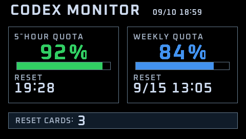

# JZ2440 Codex Monitor

A single-page Codex quota monitor for the JZ2440/S3C2440A:

```text
Windows Codex quota
    -> Windows Bridge
    -> PL2303 USB serial
    -> JZ2440
    -> 480x272 RGB565 LCD
```



This is an experimental hobby project. The monitor has been validated on a
JZ2440 board running Linux 2.6.22.6.

## Hardware target

- Samsung S3C2440A / ARM920T / ARMv4T
- Linux 2.6.22.6
- 64 MB RAM
- `/dev/fb0`, 480x272, RGB565
- Direct serial backend: `/dev/s3c2410_serial0`
- USB-COM1 uses an authentic Prolific PL2303 device; the Windows COM number may change after reconnecting.

## Architecture

### Windows Bridge

- Reads real Codex quota through the local Codex app-server.
- Encodes quota snapshots as the versioned CQM1 protocol.
- Uses 115200 8N1 with no flow control.
- Automatically discovers the unique Prolific device by `VID_067B&PID_2303`, while allowing an explicit `--port COMx` override.
- Retries provider, serial-open, write, disconnect, and reconnect failures without sending fabricated quota values.

### JZ2440 target

- Freestanding OABI syscall runtime; no target libc or dynamic linker.
- ARMv4T/ARM920T-compatible build flags.
- Direct serial input mode and a debug stdin mode.
- Framebuffer renderer with generated Oxanium bitmap glyphs and RGB565 alpha blending where needed.

Modern ordinary ARM EABI binaries may not run on this old target system. The
target therefore uses ARMv4T, ARM920T, APCS GNU/OABI, freestanding, and
`nostdlib` settings rather than a conventional modern ARM/glibc build.

The target displays:

- 5-Hour Quota and reset time
- Weekly Quota and reset date/time
- Reset Cards
- Current time and stale status

Font licensing is documented in [docs/THIRD_PARTY_NOTICES.md](docs/THIRD_PARTY_NOTICES.md).

## Build and preview

Target compilation requires the Ubuntu ARM GNU cross-toolchain used for the
validated build (`arm-linux-gnueabi-gcc` 11.4.0 and matching binutils). The
canonical flags are in [scripts/target-flags.txt](scripts/target-flags.txt),
and the reproducible build/inspection workflow is documented in
[docs/BUILD_TARGET.md](docs/BUILD_TARGET.md).

```powershell
powershell -ExecutionPolicy Bypass -File scripts\build-target.ps1
python scripts\preview.py
```

The host preview reuses the formal target renderer. A review copy is kept at
[docs/images/ui-preview.png](docs/images/ui-preview.png); generated build
outputs under `build/` are intentionally not committed.

## Current validation status

- `FONT_HARDWARE_GATE = PASS`
- `UI_FINAL_GATE = PASS`
- `DEPLOYMENT_PREP_GATE = PASS`
- Latest validated target: 50320 bytes, SHA256 `F933F354A2F95AB713930E60E61F6380AFBFB41918D37B6EB1CB8263A8DD96A9`
- Persistent deployment: **NOT YET ENABLED**

The project has not modified U-Boot, bootargs, kernel, NAND, rootfs, init, or
Qtopia startup files, and has not configured monitor autostart. Temporary
target test files belong under `/tmp` on the board only.

## Repository scope

This repository contains source code, build scripts, documentation, and the
build-time font inputs needed to reproduce the target. Local build outputs,
compiled Bridge binaries, logs, IDE state, credentials, and temporary files
are excluded by [.gitignore](.gitignore).
